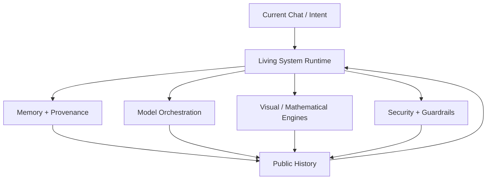

# ◈ NEXUS — Living System Runtime

> **A public, evolving record of the NEXUS / GAIA Living System: architecture, experiments, runtime patterns, mathematical engines, memory systems, and the engineering history that connects them.**

[](docs/living-system-runtime/README.md)
[](docs/living-system-runtime/HISTORY_INDEX.md)
[](docs/living-system-runtime/SOURCE_REGISTER.md)

---

## 0. The Runtime in One View

The Living System Runtime is organized around a simple recursive loop:

```text
┌──────────┐
│  INTENT  │
└────┬─────┘
     ↓
┌──────────────┐
│ DECOMPOSE    │
└────┬─────────┘
     ↓
┌──────────────┐
│ MAP / MODEL  │
└────┬─────────┘
     ↓
┌──────────────┐
│ CONSTRUCT    │──────► artifacts / code / visualizations
└────┬─────────┘
     ↓
┌──────────────┐
│ VALIDATE     │──────► tests / telemetry / review
└────┬─────────┘
     ↓
┌──────────────┐
│ REFLECT      │──────► memory / provenance / lessons
└────┬─────────┘
     ↓
┌──────────────┐
│ CONVERGE  ◈  │
└────┬─────────┘
     │
     └───────────────► next iteration
```

### Capability demonstration

```text
Input:  "Build a mathematical visualization."

Intent      → visualization
Decompose   → field + renderer + controls + telemetry
Map         → SDF + manifold + rotor + wave model
Construct   → WebGL / HTML runtime
Validate    → renderer guard + frame telemetry + fallback
Reflect     → archive artifact + record provenance
Converge    → publish the next reproducible iteration
```

The important property is not any single component. It is the **ability to carry an idea through the complete loop while retaining its history**.

---

# 1. Living System Runtime

The current project is the convergence layer for the broader NEXUS work. Historical subsystems are not discarded; they become named layers in an evolving provenance graph.



### Demonstration: provenance as a first-class object

```json
{
  "intent": "advance-runtime",
  "surface": "living-system-runtime",
  "artifact": "README.md",
  "iteration": "next-strategic-movement",
  "status": "published-to-draft-branch",
  "next": "review → validate → converge"
}
```

This repository therefore functions as both **software surface and historical ledger**.

→ [Runtime history](docs/living-system-runtime/HISTORY_INDEX.md)

---

# 2. Mathematical Visualization Engine

The project contains experimental browser engines that combine interactive controls, real-time telemetry, implicit fields, ray marching, differential geometry, Clifford/Quaternion operations, neural/hash-field concepts, and wave-style transformations.

The supplied Space-Time engine exposes field-model selectors including a Clifford hyper-torus, Riemannian spacetime singularity, geometric-algebra bivector lattice, and neural implicit multi-resolution field. fileciteturn13file0

A later engine expands the model surface to Kerr-style gravitational fields, Hopf fibrations, Calabi–Yau projections, geometric algebra, quantum wavepackets, and neural hash fields. fileciteturn13file1

### Demonstration: field pipeline

```text
position p
   │
   ├── metric deformation gᵢⱼ
   │
   ├── logarithmic / exponential mapping
   │
   ├── implicit field f(x,y,z)
   │
   ├── ray-march evaluator
   │
   ├── surface / volumetric response
   │
   └── telemetry
          ├── FPS
          ├── steps / ray
          ├── probe state
          └── renderer guard
```

The experimental EXP-LOG engine explicitly exposes exponential/logarithmic controls, Riemannian curvature, Clifford bivector rotors, subgroup state, and a WebGL2 renderer guard. fileciteturn13file3

### Mathematical demonstration

A representative field transformation can be expressed as:

$$
w = \ln(1 + \alpha r)
$$

followed by exponential-map / curvature behavior and an implicit field evaluation. The supplied engine exposes the distortion parameter $\alpha$ and curvature $K$ interactively. fileciteturn13file3

For a compact computational probe:

```js
const r = Math.hypot(x, y, z);
const w = Math.log1p(alpha * r);
const damping = Math.exp(-lambda * t);
const field = damping * Math.sin(w + phase);
```

**The README demonstrates the mechanism; it does not claim that the experimental equations constitute a new physical theory.**

---

# 3. Clifford / Quaternion Fallback

The mathematical engines use quaternion-style rotation and geometric-algebra concepts as part of their visualization and fallback architecture. The router prototype explicitly implements quaternion multiplication and normalization. fileciteturn13file4

### Demonstration

```js
q_result = q_a.multiply(q_b).normalize();
```

Conceptually:

$$
q = w + xi + yj + zk
$$

with normalized composition used as a compact rotational state representation.

```text
Primary representation
        │
        ▼
Clifford / rotor state
        │
        ├── geometric transform
        └── quaternion-compatible fallback
```

---

# 4. Neural / Hash-Field Concepts

The visualization layer includes multi-resolution hash-grid concepts and neural implicit field controls. The engines expose adjustable hash spatial frequency / resolution and identify multi-resolution hash fields as part of the rendering pipeline. fileciteturn13file0 fileciteturn13file4

### Demonstration: multi-resolution idea

```text
coarse grid ──────┐
medium grid ──────┼──► feature lookup ──► field estimate
fine grid ────────┘
```

The intent is to make the **representation itself inspectable**: parameters, transforms, render mode, and telemetry are surfaced rather than hidden behind a single output.

---

# 5. Multi-Model Orchestration

The router prototype provides a dispatcher surface for multiple model strategies, including dynamic routing, local Ollama execution, OpenAI routing, and Gemini routing. fileciteturn13file4

### Demonstration: routing matrix

```text
                    ┌───────────────┐
                    │   REQUEST     │
                    └───────┬───────┘
                            ↓
                    ┌───────────────┐
                    │ DYNAMIC_AUTO  │
                    └───────┬───────┘
                 ┌──────────┼──────────┐
                 ↓          ↓          ↓
             EDGE_LOCAL  FRONTIER   ALTERNATE
              OLLAMA      MODEL      MODEL
                 │          │          │
                 └──────────┼──────────┘
                            ↓
                       OBSERVATION
                            ↓
                         RESULT
```

### Demonstration: policy boundary

```text
credentials → runtime configuration
prompt      → routing decision
model       → execution surface
result      → validation
telemetry   → provenance
```

Credentials belong in environment/configuration—not in public source, README examples, or committed history.

---

# 6. Visual Runtime as an Instrument

The browser engines are designed as **interactive instruments**, not static screenshots.

A typical surface exposes:

| Layer | Demonstration |
|---|---|
| Field | Change the implicit mathematical model |
| Geometry | Deform curvature / manifold parameters |
| Rotation | Adjust rotor / quaternion state |
| Sampling | Change ray-march precision |
| Neural | Change hash-grid resolution |
| Spectrum | Change rendering palette |
| Telemetry | Observe FPS, steps, probes, guards |
| Fallback | Detect WebGL failure and preserve a usable surface |

The EXP-LOG engine includes a CPU 2D canvas fallback that is hidden unless WebGL fails, making renderer failure part of the designed state space rather than an unhandled exception. fileciteturn13file3

---

# 7. Memory, History, and Convergence

The Living System Runtime treats previous work as input to future work.

```text
CHAT
 │
 ▼
SESSION RECORD
 │
 ├── decisions
 ├── artifacts
 ├── experiments
 ├── failures
 └── discoveries
 │
 ▼
HISTORICAL INDEX
 │
 ▼
CURRENT RUNTIME
 │
 ▼
NEXT ITERATION
```

### Demonstration: the repository is the convergence boundary

```text
historical artifact
      ↓
classified provenance
      ↓
safe public representation
      ↓
README / documentation
      ↓
reproducible implementation
      ↓
review
      ↓
next strategic movement
```

This keeps the project from becoming a collection of disconnected experiments.

---

# 8. Public-History Strategy

The public archive is intentionally additive.

```text
PRIVATE / SENSITIVE MATERIAL
          │
          ├──► excluded from public publication
          │
          ▼
SAFE HISTORICAL RECORD
          │
          ▼
PUBLIC ARTIFACT
          │
          ▼
REVIEWABLE CHANGE
          │
          ▼
MAINLINE RUNTIME
```

This boundary matters because historical project material can contain configuration, network, credential, or device information that should not be promoted into a public repository merely because it exists in project history.

→ [Source register](docs/living-system-runtime/SOURCE_REGISTER.md)

---

# 9. Current Strategic Movement

**Movement:** turn the repository README into an executable mental model of the system.

The README now demonstrates the project at multiple scales:

```text
SYSTEM SCALE
    │
    ├── Living System loop
    │
    ├── provenance graph
    │
    ├── model routing
    │
    └── public-history boundary

ENGINE SCALE
    │
    ├── mathematical field
    ├── manifold transformation
    ├── Clifford / quaternion state
    ├── neural/hash representation
    └── rendering telemetry

CODE SCALE
    │
    ├── JavaScript field probe
    ├── routing matrix
    └── validation / fallback pattern
```

### The next iteration

```text
README
  ↓
interactive demos
  ↓
artifact index
  ↓
reproducible launch commands
  ↓
CI validation
  ↓
release surface
```

The objective is straightforward: **every major claim should eventually point to an inspectable artifact, and every artifact should retain enough provenance to explain why it exists.**

---

# 10. Repository Navigation

- **Living System Runtime:** `docs/living-system-runtime/`
- **History index:** `docs/living-system-runtime/HISTORY_INDEX.md`
- **Architecture timeline:** `docs/living-system-runtime/ARCHITECTURE_TIMELINE.md`
- **Public source register:** `docs/living-system-runtime/SOURCE_REGISTER.md`
- **Historical session records:** `docs/living-system-runtime/history/`

---

# 11. Status

```text
╔════════════════════════════════════════════════════════════╗
║                NEXUS LIVING SYSTEM RUNTIME                ║
╠════════════════════════════════════════════════════════════╣
║ PUBLIC HISTORY       │ ACTIVE                             ║
║ RUNTIME CONVERGENCE  │ ACTIVE                             ║
║ MATH VISUALIZATION   │ EXPERIMENTAL / ACTIVE              ║
║ MODEL ORCHESTRATION  │ EXPERIMENTAL / ACTIVE              ║
║ PROVENANCE           │ ACTIVE                             ║
║ README DEMONSTRATION │ ADVANCED PASS                      ║
╚════════════════════════════════════════════════════════════╝
```

> **Build it. Observe it. Record it. Validate it. Advance it.**

---

## License / Provenance

See the repository's project files and `docs/living-system-runtime/SOURCE_REGISTER.md` for the current publication boundary and provenance policy.
